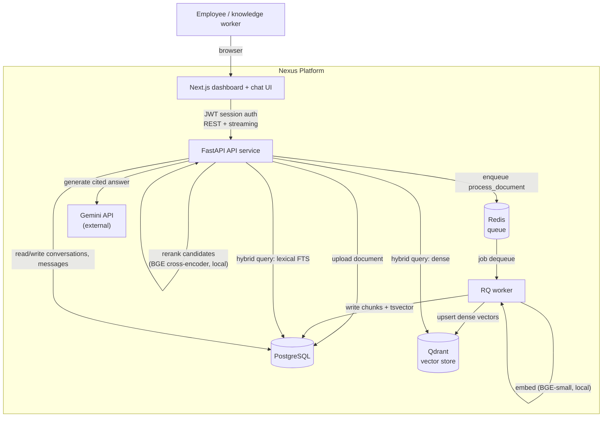
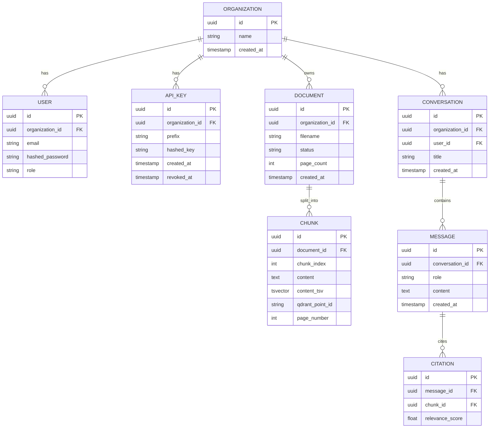

# Architecture: Nexus

## System diagram

## Component responsibilities

| Component | Responsibility |
|---|---|
| API service | Auth, document upload, hybrid retrieval, reranking, RAG orchestration (LangGraph), conversation REST/streaming API, OpenAPI docs |
| Worker | Async document processing: parsing, chunking, embedding, vector upsert, full-text index write |
| Web dashboard | Document library, ingestion status, chat interface with streaming answers and inline citations |
| PostgreSQL | System of record for all entities, plus full-text search index (lexical retrieval half of hybrid search) |
| Qdrant | Dense vector store (semantic retrieval half of hybrid search) |
| Redis | Job queue between API and worker |
| Gemini (external) | Final citation-backed answer generation from the reranked context |

## Entity relationship (core tables)

## Request flow: ingesting a document

1. User uploads a PDF/text file via the dashboard.
2. API validates the file, persists a `Document` row (`status=queued`), stores the raw file, returns immediately.
3. API enqueues `process_document(document_id)` onto Redis.
4. Worker picks up the job: parses the file (`pypdf` for PDF), chunks the text, computes an embedding per chunk (`BAAI/bge-small-en-v1.5`, run locally via `sentence-transformers`), upserts each chunk's vector into Qdrant, writes `Chunk` rows to Postgres (with `content_tsv` populated for full-text search), and updates `Document.status` to `ready` (or `failed` with an error detail).
5. Dashboard polls/refetches document status and reflects `ready` once processing completes.

## Request flow: answering a question

1. User sends a message in a conversation via the chat UI.
2. API resolves conversation history (prior turns) and runs the LangGraph RAG graph:
   - **Retrieve node**: run dense search (Qdrant, embed the query with the same BGE-small model) and lexical search (Postgres FTS) in parallel, merge into one hybrid candidate set.
   - **Rerank node**: score each candidate against the query with a local BGE cross-encoder (`BAAI/bge-reranker-base`), keep the top-K.
   - **Generate node**: send the reranked chunks plus conversation history to Gemini, prompted to answer using only the provided context and to cite chunk sources.
3. API persists the assistant `Message` plus `Citation` rows linking to the chunks actually used, and streams the answer to the client as it generates.
4. Chat UI renders the streamed answer with inline citation markers linking back to the source document/passage.

## Deployment topology (v1)

Single-host Docker Compose: `api`, `worker`, `web`, `postgres`, `qdrant`, `redis` containers on one Docker network, `web` and `api` exposed to the host. `GEMINI_API_KEY` is the only required external secret; embedding and reranking models run locally in the `api`/`worker` containers. See the deployment guide in the root README once the scaffolding PR lands.
